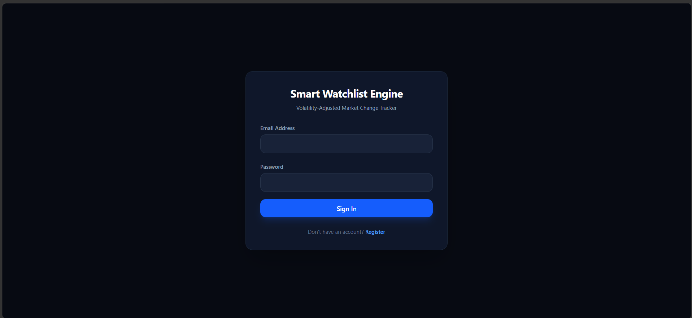
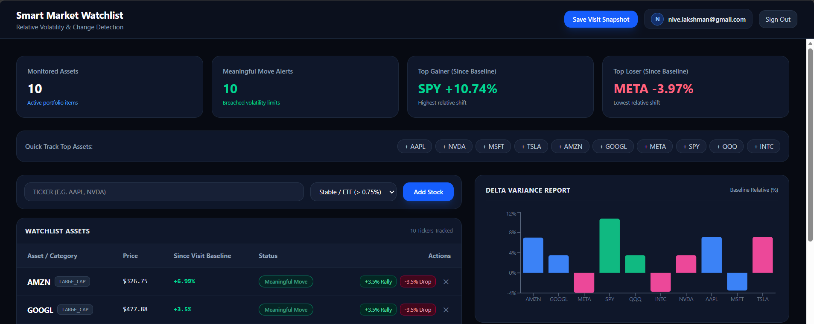
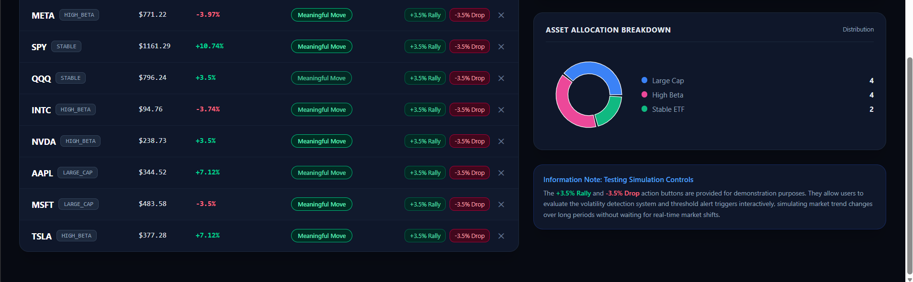
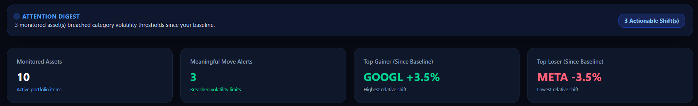
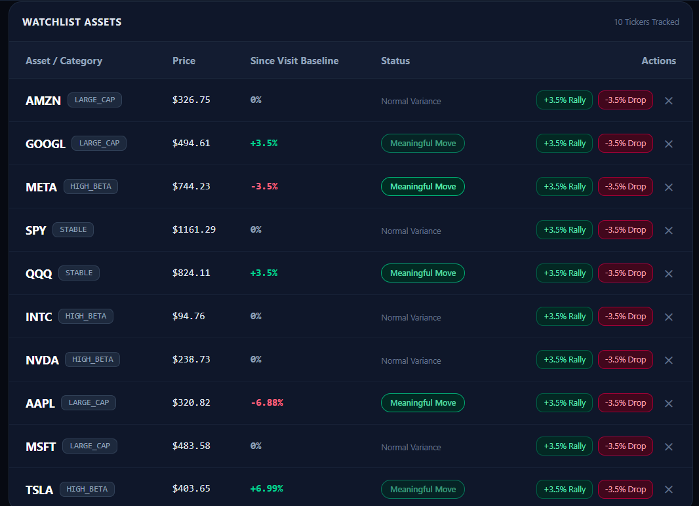

# Smart Market Watchlist — Complete Walkthrough & Feature Guide

This guide provides a step-by-step visual walkthrough of the Smart Market Watchlist application, explaining its key features, user flows, and how to operate the system.

---

## 1. Authentication & Account Setup

Users sign in or create an isolated portfolio profile using secure JWT authentication.

### Steps:
1. Launch the application in your browser.
2. Select **Register** to create a new user profile, or enter your credentials under **Sign In**.
3. Upon authentication, a secure session token is stored locally to persist your state across visits.

---

## 2. Dashboard Overview & Monitored Metrics

Once logged in, you enter the main workspace showing active portfolio metrics, real-time delta alerts, and categorical asset breakdowns.

### Surface Highlights:
* **Monitored Assets:** Total active portfolio items tracked.
* **Meaningful Move Alerts:** Count of stocks exceeding their category volatility limits since your baseline visit.
* **Top Gainer / Loser:** Instant identification of extreme relative market shifts.

---

## 3. Attention Digest & Volatility Thresholds

The **Attention Digest** banner highlights high-priority movements requiring immediate focus.

### How Category Thresholds Work:
* **Large Cap (`LARGE_CAP`):** Triggers alert on moves exceeding $\pm 1.2\%$.
* **High Beta (`HIGH_BETA`):** Triggers alert on moves exceeding $\pm 3.0\%$.
* **Stable ETF (`STABLE`):** Triggers alert on moves exceeding $\pm 0.75\%$.

---

## 4. Capturing & Resetting Visit Baselines

State persistence allows users to track changes relative to a specific point in time rather than arbitrary day changes.

### Steps:
1. Click **Save Visit Snapshot** in the top header to capture current prices as your reference baseline.
2. All percentage deltas under **Since Visit Baseline** calculate relative changes against this snapshot.
3. Click **Reset Baseline** at any time to clear snapshot reference points and return deltas to `0.00%`.

---

## 5. Market Simulation Controls

To test anomaly detection and alert triggers without waiting for real-time market movement, use the inline simulation controls.

### Steps:
1. Locate any stock row in the **Watchlist Assets** table.
2. Click **+3.5% Rally** to simulate a positive market jump.
3. Click **-3.5% Drop** to simulate a negative market decline.
4. Observe the updated **Delta Variance Report** bar chart and the **Meaningful Move** status badges reflecting the simulated shift.

---

## 6. Asset Allocation & Visual Delta Reports

The right column provides graphical views comparing relative stock shifts and category distributions:

* **Delta Variance Report:** Bar chart showing percentage changes color-coded by category (Blue for Large Cap, Pink for High Beta, Green for Stable ETF).
* **Asset Allocation Breakdown:** Donut chart displaying portfolio balance across risk tiers.